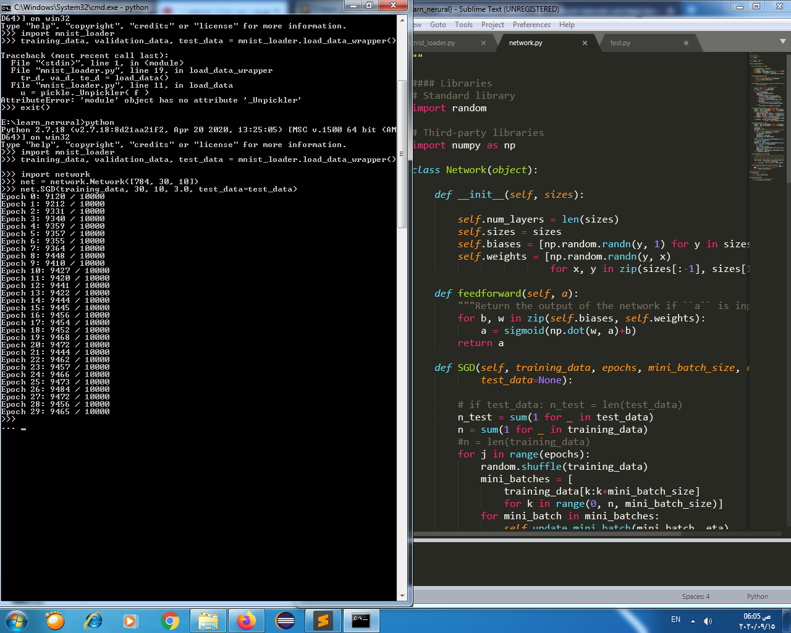

# build simple neural network to recognize handwritten digit using mnist dataset by the help of neural_network & deep learning tutorial
note: the code works for python2 if you use python3 you have to make some changes or create virtual environment and use python2 

